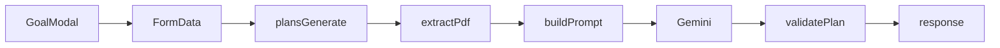

# Task type, topics, and PDF-aware plan generation

## Goals

- Add **Goal type** (e.g. `assignment` vs `quiz_exam`) so the planner **splits work differently**:
  - **Assignment**: split into concrete deliverable chunks (sections, milestones) across days.
  - **Quiz / exam**: mix **learning** sessions, **practice**, and **revision** aligned to **topics** and optional **PDF-derived content**.
- Add **topic input** (free text / list) so plans are not just `"DBMS assignment"` every day.
- Support **both** pasted notes and **PDF upload** (server extracts text, merges with paste).

## Data flow

## Backend (Express)

1. **New dependencies** in `backend/package.json`: `multer` (memory upload), `pdf-parse` (text extraction from buffer). Enforce **max file size** (e.g. 5MB) and **MIME** `application/pdf`.
2. **New route shape** for `[backend/src/routes/plansRoutes.ts](backend/src/routes/plansRoutes.ts)`:
  - Change `POST /api/plans/generate` to `**multipart/form-data`** (or keep JSON path for backward compat — prefer **one** path: multipart only, with all fields as text parts).
  - Fields: existing `taskTitle`, `subject`, `totalHours`, `deadline`, `today`, `dailyLimit`, `burnoutLevel`, `preferredStudyStyle` + new `**goalType`** (`assignment` | `quiz_exam` | `other`), `**topics**` (string), `**pdfNotes**` (optional string, pasted content), optional file field `**pdf**`.
  - If `pdf` present: read buffer, run `pdf-parse`, append to a **combined context** string with a clear separator (e.g. `--- Pasted notes ---` / `--- Extracted from PDF ---`). **Truncate** total context (e.g. 24k–32k chars) before sending to Gemini.
  - On extraction failure: return **400** with a clear message; do not crash.
3. **Extend** `[backend/src/services/gemini.ts](backend/src/services/gemini.ts)`:
  - Extend `GeneratePlanInput` with `goalType`, `topics`, `contextText` (combined notes + PDF).
  - Update `buildPrompt()` with **branching rules**:
    - **assignment**: divide the assignment into ordered subtasks; each calendar day’s `task` should name the chunk (e.g. “DBMS — ER diagram draft”).
    - **quiz_exam**: schedule **learning** vs **practice** vs **revision** days; `task` should reflect session type + topic when possible; use `contextText` to prioritize topics mentioned in PDF/notes.
  - Keep JSON output shape **unchanged**: `[{ date, hours, task }]`. Per-day `task` becomes the **variable** label (topics, session type), not only the title.
4. **Fallback** `[backend/src/services/planDistributor.ts](backend/src/services/planDistributor.ts)`:
  - Extend `DistributeInput` with optional `goalType`, `topics` (string).
  - If `topics` contains lines (split by newline or comma), assign **rotating** labels per day; else use generic labels like `Title — block 1/3`.
  - For `quiz_exam`, prefer labels like `Learning: …`, `Practice: …`, `Revision` in a simple cycle when `goalType` is set (no PDF parsing in fallback).

## Frontend

1. `**[frontend/src/routes/calendar/components/GoalModal.tsx](frontend/src/routes/calendar/components/GoalModal.tsx)`**:
  - Add **Goal type** (`<select>` or radio): Assignment / Quiz or exam / Other.
  - Add **Topics / syllabus** (`<textarea>`): placeholder “List topics, one per line…”
  - Add **Notes from PDF (paste)** optional textarea.
  - Add **optional PDF file** `<input type="file" accept="application/pdf" />`.
  - On **Generate**, build `**FormData`** with all fields + file (if any), `POST` to `/api/plans/generate` (no `Content-Type` header so browser sets multipart boundary).
2. `**[frontend/src/lib/api.ts](frontend/src/lib/api.ts)**`:
  - Extend `generatePlan` to accept `goalType`, `topics`, `pdfNotes`, `pdfFile?: File | null` and send `FormData` instead of JSON.
  - Map profile fields (`dailyLimit`, etc.) into the same form fields the backend expects.
3. `**[frontend/src/routes/calendar/CalendarPage.tsx](frontend/src/routes/calendar/CalendarPage.tsx)**`:
  - Pass extended fields from `GoalModal` into `generatePlan`.
4. **Todo saving** (`[bulkCreateTodos](e:\StudySync\frontend\src\lib\api.ts)`): unchanged — each day still maps `task` → `task_title`; calendar will show **per-day** labels.

## Testing / docs

- Add a small backend unit test for **prompt building** or **context truncation** (optional).
- Update `[README.md](e:\StudySync\README.md)`: document new form fields, PDF size limit, and that `GEMINI_API_KEY` improves topic-aware splitting.

## Risks / caveats

- **PDF quality**: `pdf-parse` works for many PDFs; scanned PDFs may yield little text (document in README).
- **Token limits**: truncate long combined context; Gemini prompt must stay within model limits.
- **Security**: no persistent PDF storage; only in-memory buffer + discard after parse.

