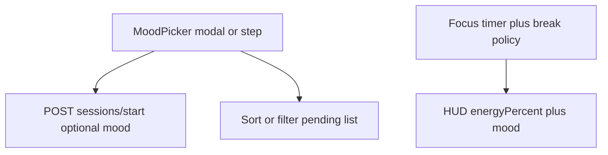

# Mental state + energy-aware breaks

## Goals

1. **Before starting focus:** ask **How are you feeling today?** (Tired / Normal / Motivated) and use that to bias **which tasks surface first** and **how often breaks are suggested**.
2. **During focus:** use **`energyPercent`** from [`useHud()`](e:\StudySync\frontend\src\context\HudContext.tsx) (same as the HUD bar) plus mood to choose work windows and break copy (e.g. mandatory recovery under low energy).

No change required to core plan generation AI; this is **session UX + ordering + timers** using existing todo fields (`hours`, `priority_tag`).

## 1. Break policy (pure logic, easy to test)

**New file** [`frontend/src/lib/sessionBreakPolicy.ts`](e:\StudySync\frontend\src\lib\sessionBreakPolicy.ts) (or `sessionMood.ts`):

- Export `type SessionMood = "tired" | "normal" | "motivated"`.
- Export `getBreakPlan(mood: SessionMood, energyPercent: number | null)` returning something like:
  - `workMinutesBeforeNudge` — base from mood (e.g. tired 15, normal 25, motivated 35), then adjust with energy: **energy > 70** stretch +40%, **40–70** baseline, **< 40** shorten work block and set `mandatoryBreakMinutes` (e.g. 5).
  - `breakSuggestionMinutes` — short vs long.
  - `headline` / `body` strings for UI ("Your brain needs recovery. Take 5 mins.", "High energy — ride the wave", etc.).

This keeps all thresholds in one place and matches your spec in spirit (exact numbers tunable).

## 2. Backend (optional but recommended)

- Extend [`StudySession`](e:\StudySync\backend\src\models\StudySession.ts) with optional `session_mood?: "tired" | "normal" | "motivated"` (default null for old rows).
- [`sessionsRoutes.ts`](e:\StudySync\backend\src\routes\sessionsRoutes.ts) `POST /start`: read `req.body.mood`, validate enum, persist on create.
- [`frontend/src/lib/api.ts`](e:\StudySync\frontend\src\lib\api.ts): `startStudySession(todoIds, options?: { mood?: SessionMood })` — forward in JSON.

Used for analytics and future AI; **breaks still run client-side** from HUD energy so they stay responsive without polling.

## 3. UI: mood check-in (gameified)

**New component** e.g. [`frontend/src/components/SessionMoodGate.tsx`](e:\StudySync\frontend\src\components\SessionMoodGate.tsx):

- Props: `open`, `onPick(mood)`, `onSkip?` (optional; if omitted, user must pick).
- Visual: three large **quest-style** cards (emoji + title + one-line effect: "Lighter blocks", "Balanced run", "Push phase").
- Framer-motion enter like existing modals.

**Wire:**

- [`SelfStudyPage.tsx`](e:\StudySync\frontend\src\pages\SelfStudyPage.tsx): on **Start focus**, open gate; on confirm, call `startStudySession([todoId], { mood })`, store `activeMood` in state for break logic.
- [`FocusSessionBar.tsx`](e:\StudySync\frontend\src\components\FocusSessionBar.tsx): same gate before `startStudySession([])`; store mood in local state for break nudges.

**Task ordering (Self-study only):** after load (or when mood changes), derive `displayTodos`:

- **tired:** sort pending by `hours` ascending, then `priority_tag` (flexible before must_do) so smaller bites float up.
- **motivated:** sort by `hours` descending, then prefer `must_do` / `suggested`.
- **normal:** keep API `sort_order` / existing list order.

## 4. UI: energy-aware breaks during session

**New hook or inline in both surfaces:** `useFocusBreaks({ sessionActive, mood, energyPercent, elapsedMs, onNudge })`

- When `elapsed` crosses `workMinutesBeforeNudge` since last break (or session start), fire **once** until user dismisses or break timer ends:
  - Use [`useRewards().push`](e:\StudySync\frontend\src\context\RewardContext.tsx) for a **game-style toast** (title like "Recovery phase" / "Shield break", subtitle from `getBreakPlan`).
  - Optional: small **full-width banner** under the timer on Self-study with countdown for suggested break minutes.

Reset "work segment" after user taps **"Back to focus"** or after `breakSuggestionMinutes` elapses (simple `useRef` segment start).

**Energy refresh:** reuse existing `refresh()` interval on active session so `energyPercent` is not stale (already present on Self-study / Focus bar).

## 5. Gameification extras (lightweight)

- One-line **buff** under the mood cards ("+Calm routing" / "+XP focus route") — cosmetic unless you add a tiny XP bump in backend on session complete when mood was set (optional follow-up).
- Copy ties to HUD: "Energy sync: 38% — recovery recommended."

## 6. Out of scope / later

- Rewriting global calendar from mood (too heavy for v1).
- Pomodoro audio (user can add later).

## Files to add or touch

| Piece | Files |
|--------|--------|
| Policy | New `sessionBreakPolicy.ts` |
| Mood UI | New `SessionMoodGate.tsx` |
| API + model | `api.ts`, `StudySession.ts`, `sessionsRoutes.ts` |
| Self-study | `SelfStudyPage.tsx` (gate, sort, break hook) |
| Quick focus | `FocusSessionBar.tsx` (gate, break hook) |

## Verification

- Start self-study with each mood: list order changes as specified.
- With mocked or real low `energyPercent`, nudge appears sooner and copy mentions recovery.
- High energy: fewer nudges / longer work segment.
- Old sessions without `mood` in DB still load; API accepts missing mood.
