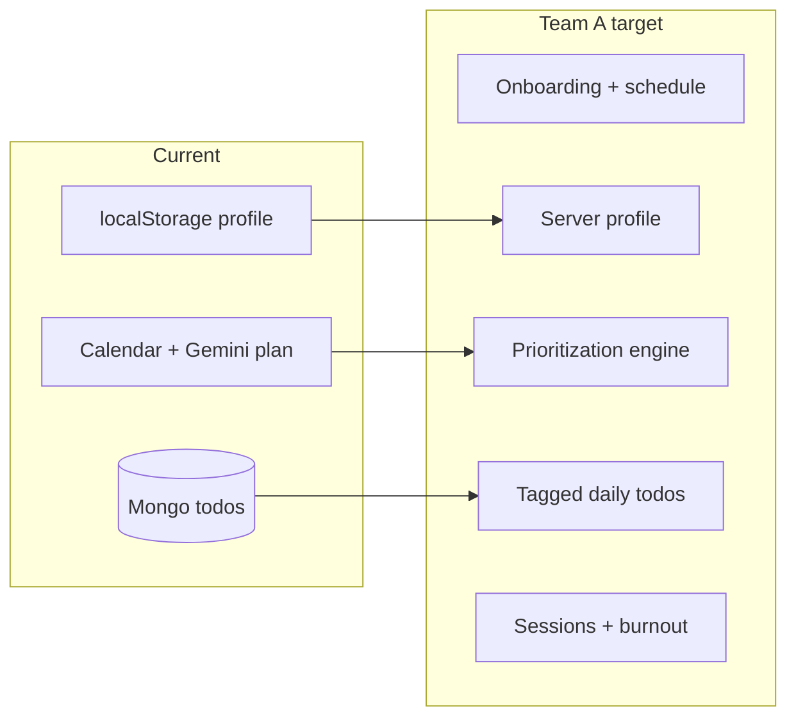

# Team A Features — Implementation Roadmap (StudySync)

## Current baseline (what exists)

| Area | Today | Location |
|------|--------|----------|
| Profile | `dailyStudyHoursLimit`, `burnoutLevel`, `preferredStudyStyle` in **localStorage** only | [frontend/src/lib/profile.ts](frontend/src/lib/profile.ts) |
| Planning | Per-goal Gemini plan → `bulkCreateTodos` | [frontend/src/routes/calendar/CalendarPage.tsx](frontend/src/routes/calendar/CalendarPage.tsx), [backend/src/routes/plansRoutes.ts](backend/src/routes/plansRoutes.ts) |
| Todos | MongoDB: `task_title`, `subject`, `date`, `hours`, `status` (pending/completed) | [backend/src/models/Todo.ts](backend/src/models/Todo.ts), [backend/src/routes/todosRoutes.ts](backend/src/routes/todosRoutes.ts) |
| User identity | Client-generated `x-user-id` header | [frontend/src/lib/userId.ts](frontend/src/lib/userId.ts), [backend/src/middleware/mockUser.ts](backend/src/middleware/mockUser.ts) |
| Group study | Socket.io study rooms (separate feature) | [backend/src/studyRoom/](backend/src/studyRoom/) |

**Not present:** onboarding flow, screen-time split, self vs group preference as a first-class field, day timeline (wake/classes/meals/free/sleep), server-side profile, AI “daily to-do” prioritization with tags (Must-do / Suggested / Flexible), drag-to-reschedule with instant re-optimize, study session entities, burnout scoring, interventions, weekly charts.

---

## Design decisions (recommended)

1. **Persist profile + schedule + sessions on the server** (MongoDB) keyed by existing `user_id`, so burnout analytics and “weekly insights” survive refresh and can support notifications later. Keep localStorage as a cache optional in Phase 1.
2. **Extend `Todo` (or add `PlannedTask`)** with: `priority_tag` (must_do | suggested | flexible), optional `slot_start` / `slot_end` or `order`, optional `skipped` state—so dashboard and calendar can show the Team A UX without overloading `status` alone.
3. **Separate “study sessions”** from todos: new `StudySession` collection (start/end, linked todo ids optional, outcome completed/skipped/abandoned).
4. **Burnout** as derived state: nightly or on-demand job computing a score from sessions + todo outcomes + profile baselines; store `BurnoutDaily` or embed in a `UserWellbeing` document for the 7-day chart.

---

## Phase 1 — Onboarding wizard + profile + day map

**Goal:** Multi-step UI + persisted `UserProfile` object matching the spec (screen time split, self/group study, schedule template, review).

- **Frontend:** New route(s) e.g. `/onboarding` with step state (screen time → preference → timeline builder → summary). “Day map summary” can reuse a simple vertical timeline component (CSS or light canvas).
- **Backend:** New `UserProfile` (or `OnboardingProfile`) Mongoose model + `GET/PATCH /api/profile` (or `/api/users/me`) using [backend/src/middleware/mockUser.ts](backend/src/middleware/mockUser.ts) for `user_id`.
- **App entry:** Gate first visit: if `onboardingComplete` false in API, redirect from [frontend/src/App.tsx](frontend/src/App.tsx) to onboarding (or show modal—full-page wizard is clearer).
- **Sync:** On completion, set flag server-side; hydrate [frontend/src/lib/profile.ts](frontend/src/lib/profile.ts) from API or deprecate in favor of API-only for new fields.

**Data shape (illustrative):** `screenTime: { mobileHours, laptopHours }`, `studyMode: 'self' | 'group'`, `dayTemplate: { wake, blocks: [...] }`, `onboardingComplete: boolean`.

---

## Phase 2 — Task planning → day-wise tagged to-dos (3–6/day)

**Goal:** After calendar tasks exist, produce **per-day** lists with time blocks and tags.

- **Inputs:** Todos in range + user profile + `dayTemplate` free slots.
- **Engine:** New service (Gemini or deterministic first): score by deadline proximity, hours, subject load; pack into free slots; cap 3–6 per day. Output writes/updates todos with new fields.
- **API:** e.g. `POST /api/plans/daily-prioritize` with `{ from, to }` or triggered from dashboard load.
- **UI:** [frontend/src/pages/Dashboard.tsx](frontend/src/pages/Dashboard.tsx) becomes the hub: list per day with tags and time blocks (reuse Tailwind patterns from calendar).

---

## Phase 3 — User interaction: drag, skip, reorder + re-optimize

**Goal:** Mutations call backend to **re-run optimizer** (or incremental adjustment) and refresh lists.

- **Frontend:** Drag-and-drop ([@dnd-kit](https://dndkit.com/) or native) on daily list; skip/reorder actions.
- **Backend:** `PATCH` batch or `POST /api/plans/rebalance` accepting user overrides (locked tasks, skipped ids, new order).
- **Performance:** Debounce re-optimize (e.g. 300–500ms) to avoid Gemini spam; optional “fast path” without AI for small moves.

---

## Phase 4 — Study session tracking

**Goal:** Log sessions with outcomes.

- **Model:** `StudySession { user_id, startedAt, endedAt, todoIds[], outcome }`.
- **API:** `POST /api/sessions/start`, `PATCH .../end` with outcome.
- **UI:** “Start focus” on a todo or global timer on Dashboard (minimal MVP).

---

## Phase 5 — Burnout detection (Green / Yellow / Red)

**Goal:** Daily score from completion rate, consistency, streaks, screen-time deviation vs onboarding baseline.

- **Service:** Pure TS module e.g. `backend/src/services/burnoutScore.ts` (testable).
- **Storage:** `BurnoutDaily { user_id, date, score, state }` or nested array in profile.
- **UI:** Badge on Dashboard + calendar header.

---

## Phase 6 — Adaptive interventions + weekly insights

**Goal:** Yellow → light suggestions; Red → reduce next-day load, rest suggestion; optional notification hook.

- **Yellow:** UI banner + copy from rules engine (no DB change required).
- **Red:** When generating next day’s todos, cap hours/tasks using [backend/src/services/planDistributor.ts](backend/src/services/planDistributor.ts) inputs or new constraints.
- **Weekly chart:** Dashboard section: last 7 `BurnoutDaily` points (use a small chart lib or SVG sparkline).

---

## Suggested build order (MVP path)

1. **Profile API + onboarding UI** (unblocks everything else).
2. **Todo schema extensions + daily prioritization endpoint + Dashboard list** (core Team A value).
3. **Sessions** (minimal) so burnout has signal.
4. **Burnout score + weekly chart**.
5. **Interventions** (rules + next-day caps).
6. **Drag/reorder + re-optimize** (highest UI complexity; can follow a working read-only tagged list).

---

## Risks and notes

- **Gemini cost/latency:** Re-optimize on every drag may be expensive; cache or hybrid deterministic+fallback-AI.
- **Auth:** Current `x-user-id` is fine for MVP; production would replace with real auth and migrate `user_id`.
- **Group vs self:** Wire `studyMode` to existing group study entry points ([frontend/src/App.tsx](frontend/src/App.tsx) `/study-room`) as a shortcut after onboarding.
